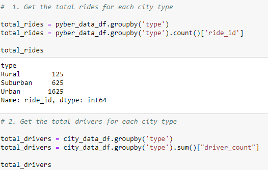
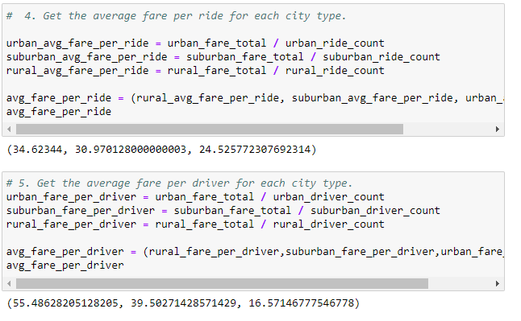
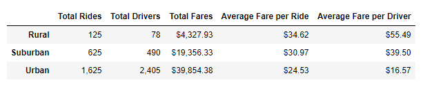
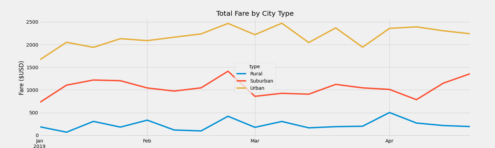

#PyBer_Analysis

## Overview of the Analysis

**PyBer Rideshare company has been conducting research on their rideshare from the first quarter of 2019. I am tasked with conducting analysis specifically looking at the city type vs. fare amount data. In this analysis I will walk you through the steps I took to arrive at my conclusions which I will reiterate in my summary section. **

The city types were: 
  * Urban
  * Suburban
  * Rural

## Results - Describe the differences in ride sharing data among the different city types

### Initial analysis: 
  
  * The initial data frames were separate. In order to begin our analysis, I merged the city_data and ride_data using a LEFT JOIN and the pyber_data_df was created.

### The PyBer Summary 
The PyBer summary df has 5 components: Total Rides, Total Drivers, Total Fares, Avg Fare per Ride, and Avg Fare per Drivers.
  * The Total Rides, Total Drivers, & Total Fares metrics were attained by creating a Series by passing the dataframe through a groupby function twice to create the series of objects which allows us to easily pass the series into a dataframe.
Example of the code. 
  
  * The last two: Average fare per ride and Average fare per driver used the division of the previously created variables. 

Example of the code. 
  
#### Results - Observations
**PyBer Summary DataFrame**

  
  * Rideshare drivers in the **Urban** cities make significantly less per driver due to oversaturation. There were not enough rides within the 1st quarter of   2019 to give each driver at least 1 ride. At least 780 drivers did not have 1 passenger. 
    - I believe the smaller than average fare per ride for urban cities is primarily due to the relatively smaller distances between drop-off points. Within urban environments, walkability/convenience are prized above most attributes, thus a rider would usually never have to go too far.
  
  * For the **Rural** fare totals, the distance between drop-off points is a definite factor in the significantly higher average fare per driver metric.
    - The total rides, drivers, and fares metrics are lower than the urban or suburban city types, there averages are both noticeably higher. 
    - Having increased distances, increases the fares and the smaller number of drivers have a significantly higher average fare per driver because of it.
  
  * **Suburban** fare totals are right under Urban totals. The distances are slightly further apart in suburban areas and that difference is reflected in the average fare per ride. Although the Suburban driver count is only ~20% of the Urban driver count, it still makes a significant change in the data.
    - With a 5th of the driver population, there is a ~$20,000 difference in total fares between suburban and urban cities. That 20K is half of the total fares generated by urban cities.

-----------------------------------------------------------------------------------------------------------------------------
  

**Multiline Chart**

*Shows weekly values by the city type, starting the January 2019.*
 
------------------------------------------------------------------------------------------------------------------------------
# Summary - Based on the results, provide three business recommendations to the CEO for addressing any disparities among the city types.
- **Recommendations**
1. PyBer should increase their marketing budgets the in all areas. Your market is so oversaturated that many of your drivers are not receiving work. Increasing the number of customers would be a great first step.
2. Put a freeze on the hiring of new drivers in only the Urban cities until the customer base can catch up to the number of available drivers. Goal being, each driver has at least 1 ride, during each quarter.
3. Additional analysis should be put into your Rural city data, there are too many questions. Why are the fares so consistently low? Should there be more advertising? Is there just little to no demand for rideshare services in these areas? Do you need to make a hiring push out there to meet demand? 
